### Intro

In [part 1](/wormhole-1-setup) we set up your development environment and downloaded the Wormhole SDK. In [part 2](/wormhole-2-full-node) we setup a full Wormhole node and confirmed wormholeREST could speak to it. Finally we're ready to create our own tokens.

Wormhole supports 3 main types of tokens—[fixed supply](#tokenFixed), [managed supply](#tokenManaged) and [crowdsales](#crowdsale). We'll look at each of those but first let's get some WormholeCash.

### Getting WormholeCash

Every Wormhole transaction is an on-chain BCH transaction w/ an `OP_RETURN`. However WormholeCash WHC is the native token of the platform. It's used to create new tokens and to purchase tokens in crowdsales. WHC is created by sending 1 BCH to a burner address which gives you 100 WHC. Burning BCH is controversal and we don't take it lightly. There are plenty of WHC for sale on markets such as [Coinex](https://www.coinex.com/exchange?currency=bch&dest=whc#limit) so we recommend getting WHC that way instead of burning more BCH.

To start out you want to fire up the wormholeREST that you configured previously.

```    
RPC_BASEURL=http://your-ip-address:18332/ RPC_PASSWORD=h4x0r RPC_USERNAME=l33t NETWORK=testnet npm run dev
```            

Once that's fired up go to [wallet/newAddress](http://localhost:3000/#/wallet/walletNewAddress) and create a new address. Here we're using `bchtest:qq8f73ywfgp0267ww3fc4mwph0ugkhns2scld80cmt`.

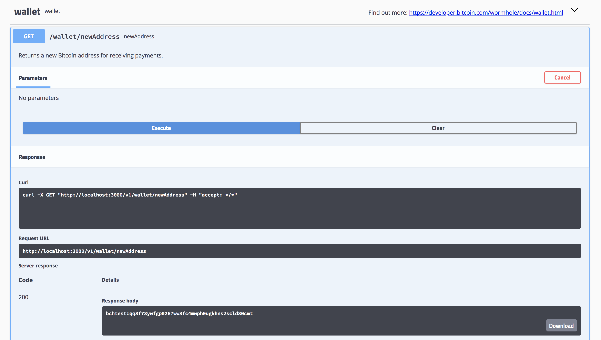

we then sent our new address 2.6 testbch. [ea9d45484acbef6f040df92bd638e9c84c6ba82388df2446ca4523e039b0d887](https://trest.bitcoin.com/v1/transaction/details/ea9d45484acbef6f040df92bd638e9c84c6ba82388df2446ca4523e039b0d887)

Next go to [transaction/burnBCHGetWHC](http://localhost:3000/#/transaction/transactionBurnBCHGetWHC), enter 1 for the amount of testBCH to burn and enter a redeemAddress where we want any change utxo sent. Doing this created txid [44bc0cdc205c0cc71adf291a65f18521f5b39fe241f54357f084a951eb038959](http://localhost:3000/v1/dataRetrieval/transaction/44bc0cdc205c0cc71adf291a65f18521f5b39fe241f54357f084a951eb038959).

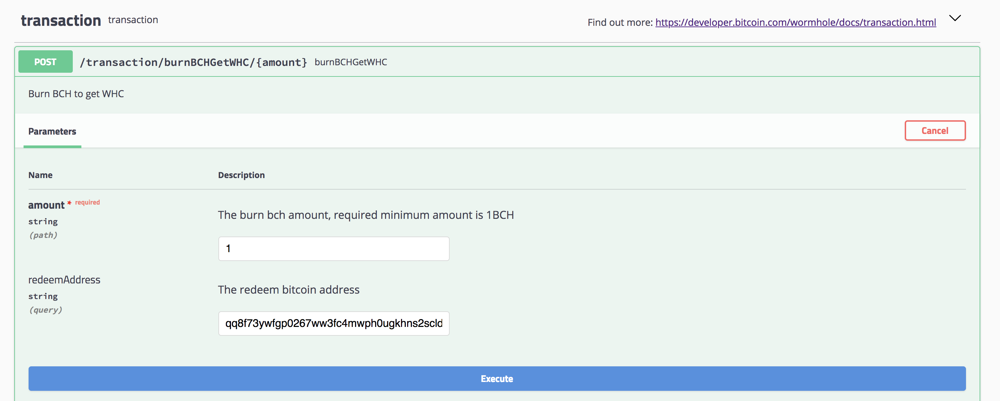

There are 2 things worth nothing here. First the 1 testBCH which was burned wasn't taken from the 2.6 we just sent in the previous steps. It now has [2.61059032](https://trest.bitcoin.com/v1/address/details/qq8f73ywfgp0267ww3fc4mwph0ugkhns2scld80cmt). The newly created 100 WHC have been assigned to [bchtest:qrf4ckh0uzfryvf9dlapje3crzl48agryv70t803gk](http://localhost:3000/v1/dataRetrieval/balancesForAddress/bchtest:qrf4ckh0uzfryvf9dlapje3crzl48agryv70t803gk). When we passed in the `redeemAddress` it sends BCH change from the burn tx but not the newly created WHC. For that it creates a new address.

When you call `/v1/dataRetrieval/balancesForAddress` it will return the balances for any tokens which that address owns. Note the `propertyid` property. 1 is WHC. When we create tokens in the coming steps they will be given their own `propertyid`.

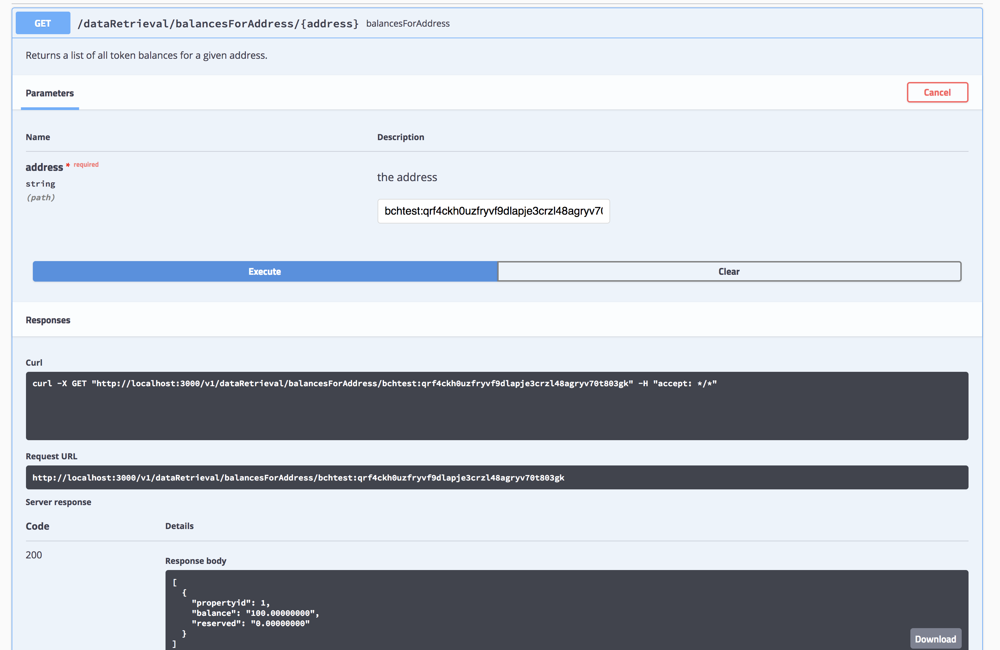

### Setup

Since every Wormhole transaction is just a BCH transaction w/ an `OP_RETURN` each step we're about to do will cost a small amount of BCH for a miner fee. I'm using [walletSendToAddress](http://localhost:3000/#/wallet/walletSendToAddress) to send just enough BCH to each address to cover the miner cost. I'm only showing it once in the screenshot below but I am doing it for each account that I send from.

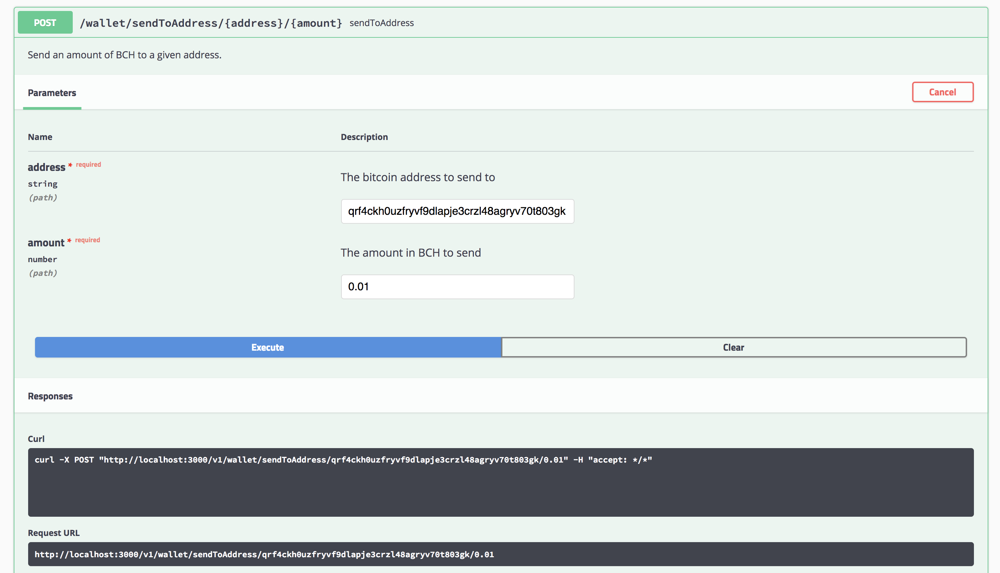

### Token with fixed supply

Creating a token costs 1 WHC. Now that we have some testWHC we're ready to create some tokens. We'll start w/ a token which has a managed supply.

#### Time Machine Token TMT

Let's say you have a time machine which can hold yourself and 3 passengers. You want to issue tokens for your time machine on BCH because you know all good time travelers accept BCH. You decide to create a new token called Time Machine Token w/ a fixed supply of 3 tokens and a ticker of TMT. For that you use [transaction/fixed](http://localhost:3000/#/transaction/transactionFixed).

`transaction/fixed` accepts several arguments so let's go over them.

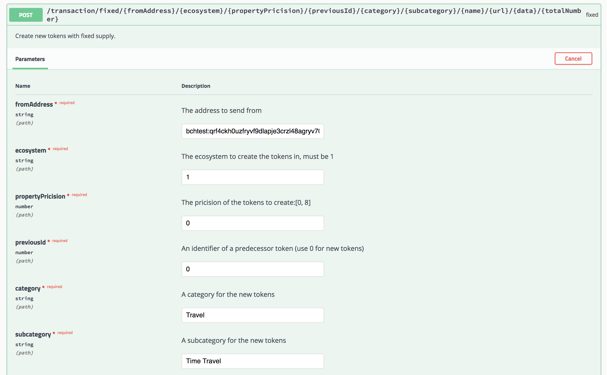

*   `fromAddress` This is the address to spend 1 WHC from in order to create a new token. We'll use our address which has 100 testWHC `bchtest:qrf4ckh0uzfryvf9dlapje3crzl48agryv70t803gk`
*   `ecosystem` The ecosystem to create the tokens in. It must be 1.
*   `propertyPrecision` This is the precision of the tokens. It's the number of decimal places the coin should have. In our case we want 3 whole coins so we put 0.
*   `previousId` An identifier of a predecessor token. We use 0 which is the code for new tokens.
*   `category` We put "Travel"
*   `subcategory` Here we use "Time Travel"
*   `name` This is the ticker symbol. In our case it's `TMT`
*   `url` A URL for further information about the new tokens
*   `data` A description for the new tokens
*   `totalNumber` The number of tokens to create. We use 3

After [running this](http://localhost:3000/v1/dataRetrieval/transaction/ac2df919be43fa793ff4955019195481878e0f0cab39834ad911124fdacfc603) we have a new token w/ [propertyid 141](http://localhost:3000/v1/dataRetrieval/property/141). It has a ticker of TMT and 3 total units. Note that `bchtest:qrf4ckh0uzfryvf9dlapje3crzl48agryv70t803gk` now has 99 WHC (propertyid 1) because it cost 1 WHC to create TMT. That address also now has 3 TMT (propertyid 141) which is the token we just created.

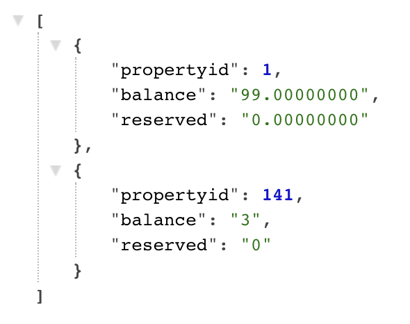

You contact your 3 favorite friends and have them send you a BCH address.

*   Friend 1: `bchtest:qqa3wurghyfkrdw59yxdp2j58gw3ta9hys33re44m9`
*   Friend 2: `bchtest:qz8wnpgtxugwucum5y2gekavpf9qx9m8wcysjk3k2c`
*   Friend 3: `bchtest:qplzhgdu5nmv8yg4r8g7zc9a02nzu46saum0swsk7c`

To send them each 1 TMT you go to [transaction/send](http://localhost:3000/#/transaction/transactionSend) and paste in `qrf4ckh0uzfryvf9dlapje3crzl48agryv70t803gk` to the `fromAddress` since it is the address which controls the 3 TMT. Paste `qqa3wurghyfkrdw59yxdp2j58gw3ta9hys33re44m9` in to the `toAddress` field for your first friend's address. That creates txid [61461167c8f4f63ee8e9849d1db05d6f2bc4269e37f63fe428af28cb02e8871c](http://localhost:3000/v1/dataRetrieval/transaction/61461167c8f4f63ee8e9849d1db05d6f2bc4269e37f63fe428af28cb02e8871c). Sending 1 TMT to each of the other addresses give us [d6bcc4215d1faab09f405f027288252720941ea52416a76be684528df5d36df9](http://localhost:3000/v1/dataRetrieval/transaction/d6bcc4215d1faab09f405f027288252720941ea52416a76be684528df5d36df9) and [a596d7361f7fb735cd740390270fbdc6239136e649ac1e8438712ae8880d29e2](http://localhost:3000/v1/dataRetrieval/transaction/a596d7361f7fb735cd740390270fbdc6239136e649ac1e8438712ae8880d29e2)

Now you can call `dataRetrieval/dataRetrievalBalancesForId` and see each of our friends now have 1 TMT.


You go cruising with your friends through time and each time you leave the time machine you send each friend a token. And each time every one boards the time machine they send you back 1 TMT.

Somewhere along the way one of your friends decides they want to leave the time machine so they transfer their TMT to a 4th friend at `bchtest:qqhqfmx7nrjgu4g33szzghgj0z8ethc0sudcyy3h8y`. For that you use [transaction/send](http://localhost:3000/#/transaction/transactionSend).

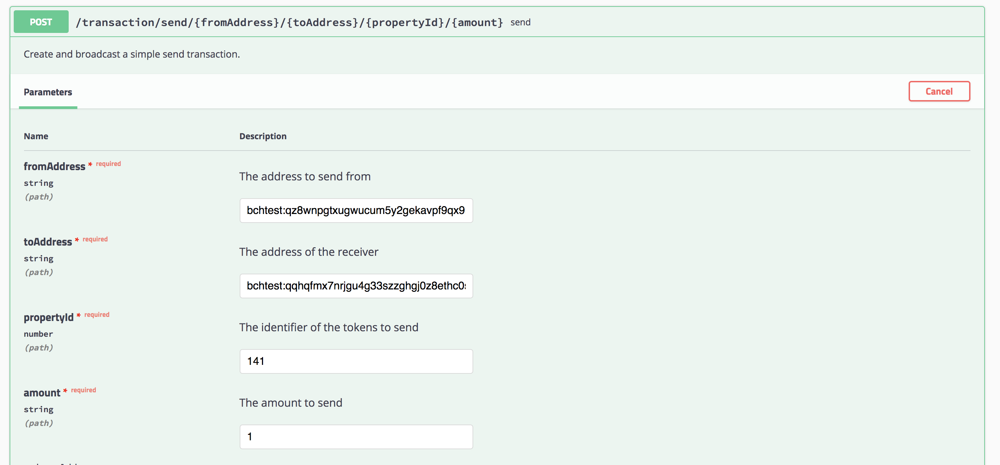

This creates a txid [e2a68d3a062b3ed95702450d627e5ab2ba034586b11f2a46185728c0cc958772](http://localhost:3000/v1/dataRetrieval/transaction/e2a68d3a062b3ed95702450d627e5ab2ba034586b11f2a46185728c0cc958772).

Any time someone wants to board your time machine all they have to do is send you 1 TMT via `transaction/send`. Also scarcity drives value so a market could spring up around TMT as a greater number of people want to ride in the time machine but the TMT are limited in number.

This works fine but what if someone loses their TMT? With a fixed supply you're unable to create new tokens. For that you need managed supply.

### Token with managed supply

Lets imagine we designed a new quantum mining ASIC. We want to create a Quantum Mining Coin w/ a QMC ticker which we can offer as shares to our employees. Each month we'll pay a portion of our profit as dividends to QMC holders. We'll want to create a token w/ a managed supply so that we can grant and revoke tokens as needed.

First let's create a new address `bchtest:qptvee3at3hypzak62c07ums7spy9zn2pv60up7csj` and send it 1 WHC w/ txid [ada116eebaa9481caef375ab0746742277f86084dd43f9ee6055b4c4cad44ad2](http://localhost:3000/v1/dataRetrieval/transaction/ada116eebaa9481caef375ab0746742277f86084dd43f9ee6055b4c4cad44ad2). Now that our new address has 1 WHC we can create a new token w/ a managed supply. For that we use [transaction/managed](http://localhost:3000/#/transaction/transactionManaged).

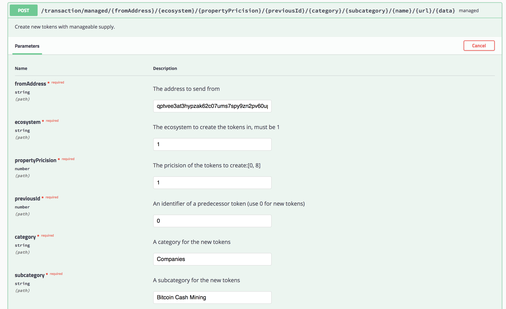

Here we're sending from the address that we just created and sent 1 WHC to, `bchtest:qptvee3at3hypzak62c07ums7spy9zn2pv60up7csj`, and we're setting the name to `QMC`. This creates [`propertyid` 142](http://localhost:3000/v1/dataRetrieval/property/142). Note `totaltokens` is 0. That's because w/ managed unit tokens you have to grant tokens for them to exist.

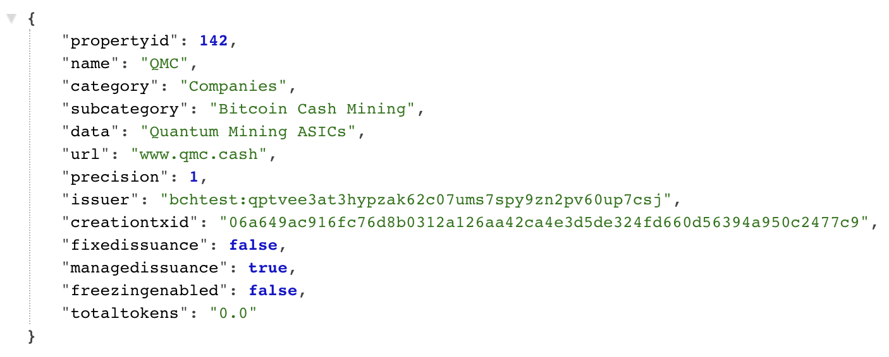

Now that we have our `QMC` let's grant some to the members of our new startup.

*   [10,000](http://localhost:3000/v1/dataRetrieval/transaction/ffd7767e05967c4b5c1e9264a47cc7dbbff8fabc969d7baf2019d841ff92d0b4) for Co\-founder 1
*   [10,000](http://localhost:3000/v1/dataRetrieval/transaction/a86d81eacce18d80d2c3cbdc4515f7d4c582704337ea64ddfeb55b5b2556fb0e) for Co\-founder 2
*   [5,000](http://localhost:3000/v1/dataRetrieval/transaction/bd374718c0efff9f8c5949b8e77a5b6fe03216c50573d62dcd5636077237b8a7) for CTO
*   [2,000](http://localhost:3000/v1/dataRetrieval/transaction/1eb3764fd212eb9aefbc0943bd25f740ca3aca3391372c0c66c4da8148e197d1) for Engineer 1
*   [1,000](http://localhost:3000/v1/dataRetrieval/transaction/f15d6f8ab8527abacc7defc0da4c08921b0027b013a73d884af0d2b79969fad1) for Engineer 1

Things are going along great but now you need to do a two things. First you need to change the primary address that can grant tokens as part of your key rotation security protocol. Second you need to revoke all QMC from Engineer 2 based on their poor peformance.

First we'll change the primary address which can issue tokens. For that we create a new address `bchtest:qqqra3q5uqm4za743nklgcckgnc7zs5uuu84q8m2w9` and use [transaction/changeIssuer](http://localhost:3000/#/transaction/transactionChangeIssuer) passing in the existing primary address, the new address and the propertyid of 142 for QMC.


This creates txid [376bb341397674d906ca51a36f63ffed9a79487a3ee3f54b7857f017ece25654](http://localhost:3000/v1/dataRetrieval/transaction/376bb341397674d906ca51a36f63ffed9a79487a3ee3f54b7857f017ece25654) of type `Change Issuer Address`.

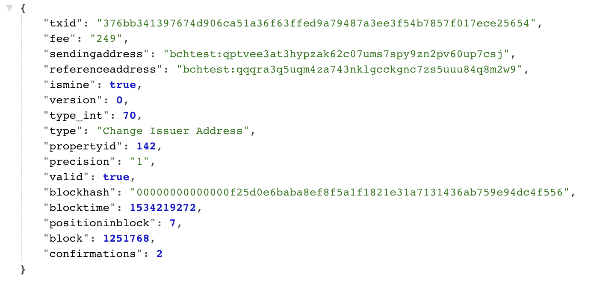

If we call [dataRetrieval/property](http://localhost:3000/#/dataRetrieval/dataRetrievalProperty) we can see it updated `issuer` to be our newly created address and `totaltokens` is now 28,000 which is how many tokens we've granted to our 5 startup employees.

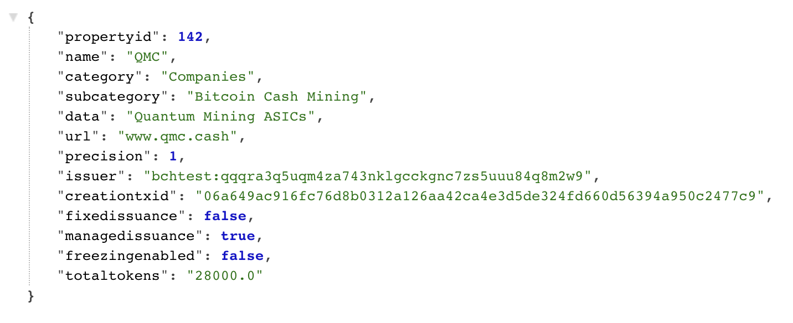

Next we want to revoke the 1,000 QMC of Engineer 2 as they are leaving the startup before they've vested. To do that first we send the 1,000 QMC from Engineer 2 to our new issuing address via [transaction/send](http://localhost:3000/#/transaction/transactionSend). This gives us txid [adad71beb476255764a3f61db28b549bf5b1cbe1810c599026262554951b744a](http://localhost:3000/v1/dataRetrieval/transaction/adad71beb476255764a3f61db28b549bf5b1cbe1810c599026262554951b744a).

Now if we check the balances for QMC with [dataRetrieval/balancesForId](http://localhost:3000/#/dataRetrieval/dataRetrievalBalancesForId) we can see the 1,000 QMC have been transferred from Engineer 2 back to our issuing address.

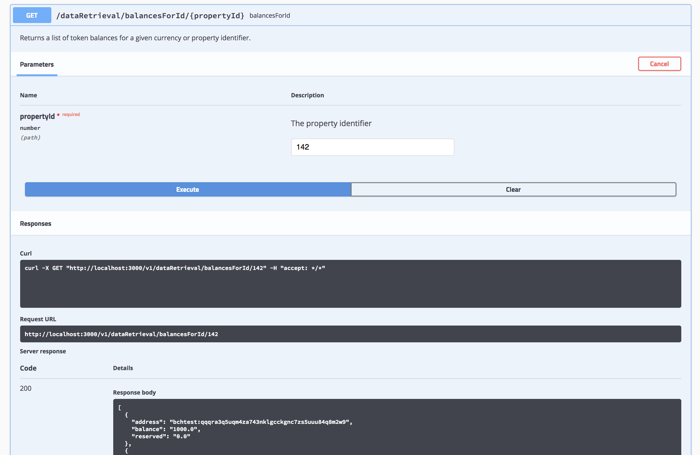

Finally we need to revoke those 1,000 QMC so they are no longer part of the total QMC total. For that we use [transaction/revoke](http://localhost:3000/#/transaction/transactionRevoke).

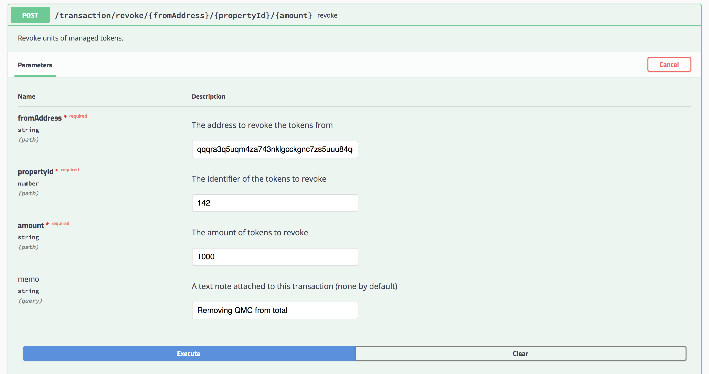

This creates a `Revoke Property Tokens` tx w/ an id of [184ecd368c9f04ca972f865c94da2f2a16b1996052ab8b23ea909f14a863d7ac](http://localhost:3000/v1/dataRetrieval/transaction/184ecd368c9f04ca972f865c94da2f2a16b1996052ab8b23ea909f14a863d7ac).

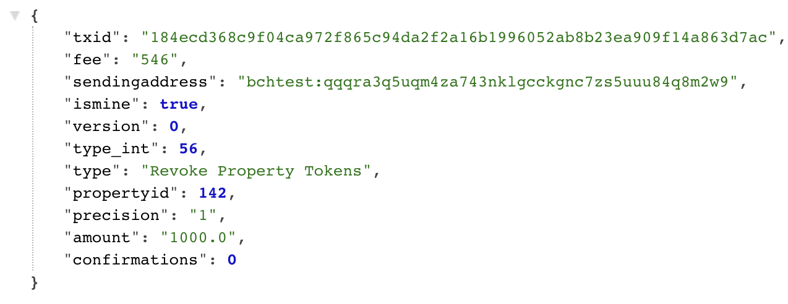

You can now confirm via [dataRetrieval/property](http://localhost:3000/#/dataRetrieval/dataRetrievalProperty) that QMC only has 27,000 coins in circulation. The 1,000 from Engineer 2 have successfully been revoked.

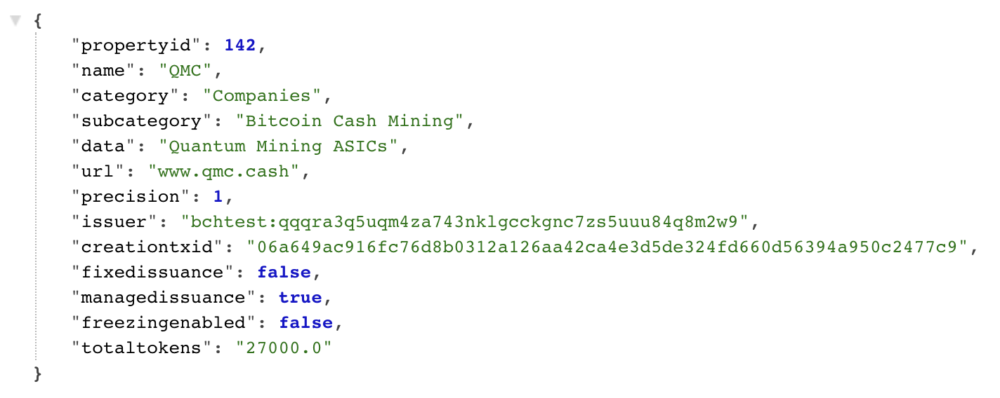

Now that we've seen how to issue tokens with a fixed or managed supply let's check out how to launch a crowdsale/ICO.

### Crowdsale/ICO

First we want to create a new address, `bchtest:qrv8jkm8hhcjfu2t8qrxnlpyn944xc0crs8q8c6rnd`, and send it 1 WHC in txid [86c69a0f6da018a34524b86f13f541149c8c806b32fc314c63d03f5ffae64885](http://localhost:3000/v1/dataRetrieval/transaction/86c69a0f6da018a34524b86f13f541149c8c806b32fc314c63d03f5ffae64885).

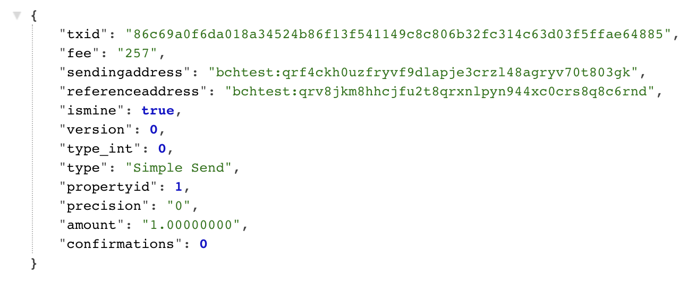

Now we're ready to create our crowdsale. We want to raise funds to perfect our life extension tech. For that we're going to create a Life Extension Token w/ a ticker of LET and we're going to have a crowdsale where we offer 1000 LET for 1 WHC. There will be in total 28,000 LET. Owners of LET will be able to redeem them 1000 LET for 1 Life Extension session.

To create a crowdsale first go to [transaction/crowdSale](http://localhost:3000/#/transaction/transactionCrowdSale). Enter the newly created address, precision 0 so we only have whole coins, the ticker symbol LET for the name and the total units of 28,000.

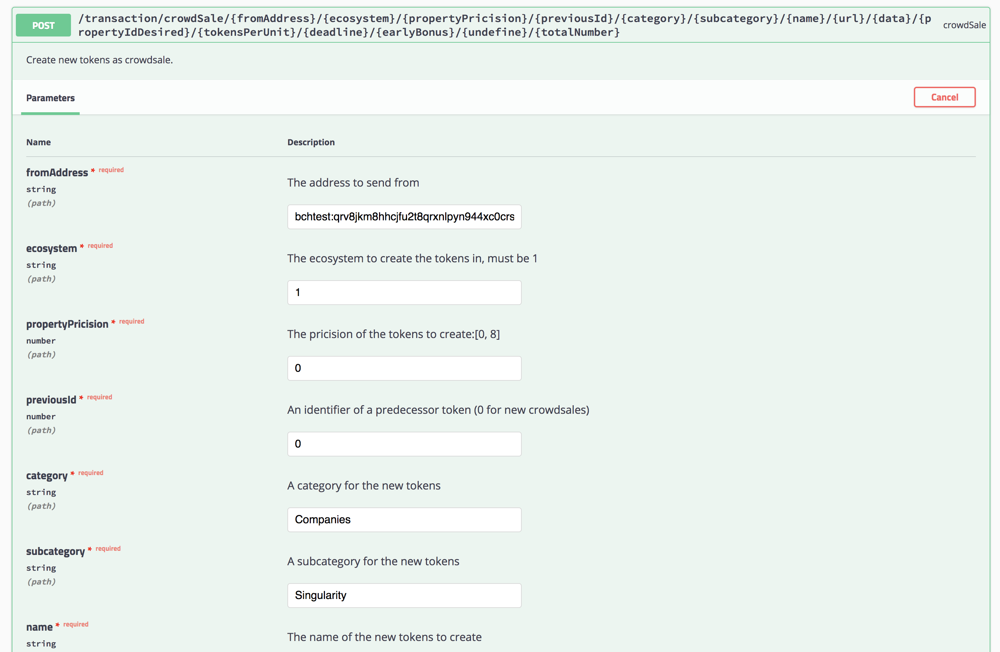

This creates [propertyid 145](http://localhost:3000/v1/dataRetrieval/property/145) for our newly created LET token.

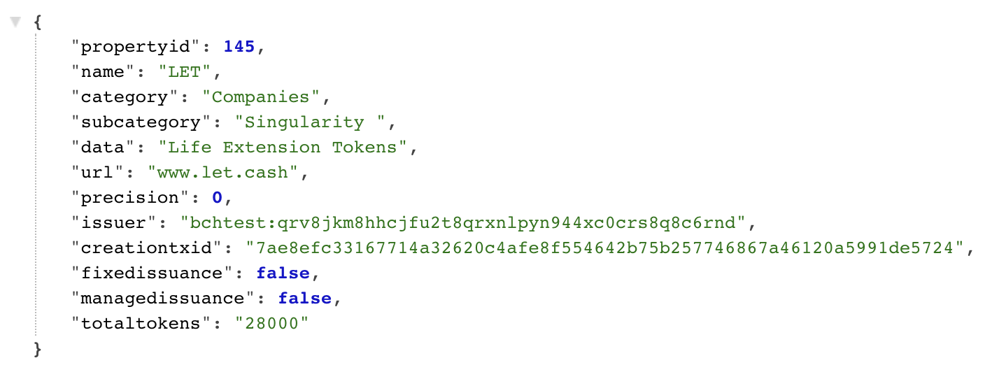

Now we tell the world about our crowdsale. We're raising funds so we can bring Life Extension to the world! People can participate in our crowdsale via [transaction/partiCrowSale](http://localhost:3000/#/transaction/transactionPartiCrowSale).

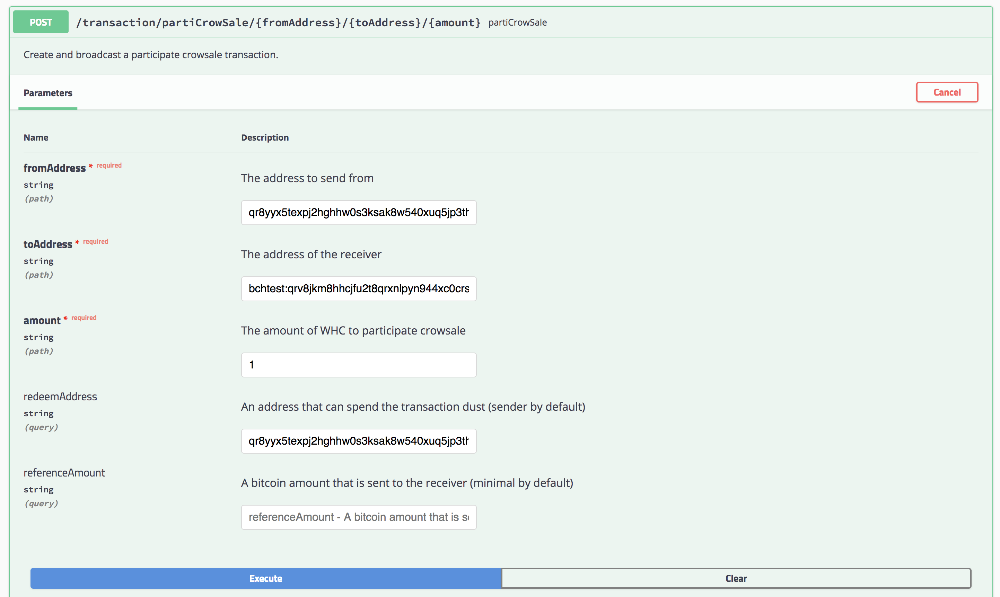

Our Crowdsale is super successful and we sell out all of our tokens. [qr8yyx5texpj2hghhw0s3ksak8w540xuq5jp3th5fz](http://localhost:3000/v1/dataRetrieval/balance/qr8yyx5texpj2hghhw0s3ksak8w540xuq5jp3th5fz/145) bought 1000 LET. [qzmqpnws9vd24hq9yx8xq3mzql0j8kejjqhdct78sf](http://localhost:3000/v1/dataRetrieval/balance/qzmqpnws9vd24hq9yx8xq3mzql0j8kejjqhdct78sf/145) bought 2000 LET. [qzv3zsanhrl8hxuj7h46sqswu6cqgy5zhyq3r4ufa7](http://localhost:3000/v1/dataRetrieval/balance/bchtest:qzv3zsanhrl8hxuj7h46sqswu6cqgy5zhyq3r4ufa7/145) really believes in the idea and bought 25,000 LET!

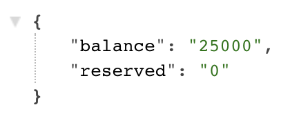

Now backers can [send us 1000 LET](http://localhost:3000/v1/dataRetrieval/transaction/1ccafb30803f9ae9642242d2dc81248f31f17eeb31321a376c7307046067295e) and redeem 1 Life Extension session. The crowdsale was a total success. Selling the 28,000 LET raised [28 WHC](http://localhost:3000/v1/dataRetrieval/balance/bchtest:qrv8jkm8hhcjfu2t8qrxnlpyn944xc0crs8q8c6rnd/1) which we can use to fund our idea.

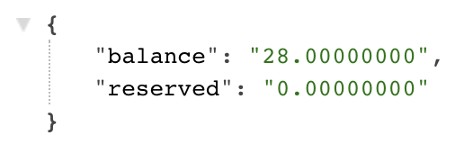

### Summary

Congrats on making it this far! You set up your development environment and installed Wormhole SDK. You then configured a full Wormhole node. In this last post you created tokens with fixed and managed supply and launched an ICO. You now have everything needed to start creating your own tokens directly on Bitcoin Cash.